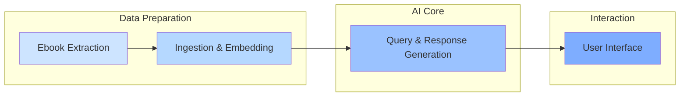

# Librarian Whitepaper

**Version 1.0**

**Date: August 04, 2025**

---

## Abstract

Librarian is an AI-powered system for querying and interacting with ebooks, enabling users to ask questions, retrieve passages, or summarize content from their personal library. Built with LangChain, it ingests ebook data, embeds it for semantic search, and uses a local AI model to generate accurate, cited responses. This whitepaper outlines the high-level architecture, key components, and integration with ebook extraction tools, providing a secure, offline way to "chat with your books."

---

## 1. Introduction

Librarian transforms static ebooks into interactive knowledge sources, allowing natural language queries like "Summarize the author's views on education in chapter 2" or "Find paragraphs on innovation from page 50." It focuses on privacy, running entirely locally without external APIs, and supports small libraries with room for growth.

The design goals are:

*   **Accuracy:** Responses grounded in ebook content with citations (book, chapter, page).
*   **Ease of Use:** Simple web interface for chatting with books.
*   **Privacy:** All processing offline, no data leaves your device.
*   **Scalability:** Handles multiple books; extensible for larger collections.
*   **Integration:** Works with exported Kindle ebooks, crediting the forked [Kindle AI Export](https://github.com/transitive-bullshit/kindle-ai-export) repo for core extraction logic.

This paper explains the system's architecture and build process at a high level.

---

## 2. System Architecture

Librarian follows a modular pipeline: extract ebooks, ingest and embed content, query via AI, and interact through a UI. It's built in Python with LangChain for AI orchestration, plus scripts in TypeScript and PowerShell for extraction.

*   **Ebook Extraction:** Converts Kindle books to usable formats (PNG images, metadata, markdown).
*   **Ingestion & Embedding:** Loads content, splits into chunks, adds metadata, and stores in a vector database.
*   **Query & Response Generation:** Retrieves relevant chunks and generates answers using a local AI model.
*   **User Interface:** Web app for querying and viewing responses.

---

## 3. Ebook Extraction

To access Kindle content, Librarian uses a forked version of [Kindle AI Export](https://github.com/transitive-bullshit/kindle-ai-export), which logs into the Kindle web reader and exports books. We extended it with:

*   **PNG Export & Metadata Capture:** Scripts (`extract-kindle-book.ts`) navigate the reader, screenshot each page as PNG, and save metadata (title, author, TOC) to JSON. This preserves layout without DRM issues.
*   **OCR Processing:** A PowerShell script (`ocr_ebook.ps1`) runs Tesseract OCR on PNGs to extract text, mapping it to chapters/pages via metadata. For better accuracy, we added a local AI transcription option (`transcribe-book-content-local.ts`) using Ollama's vision model (e.g., LLaVA) to convert images to text verbatim.

Outputs are stored per book (e.g., `books/ASIN/book.md` and `metadata.json`), ready for ingestion.

---

## 4. Ingestion and Embedding

Once extracted, ebooks are processed into a searchable format.

*   **Loading & Splitting:** Markdown files are loaded (`UnstructuredMarkdownLoader`), split into ~1000-character chunks with overlap for context preservation (`RecursiveCharacterTextSplitter`).
*   **Metadata Enrichment:** Each chunk gets details like book title, author, chapter, and page from JSON TOC and page markers (e.g., `[Page X]`).
*   **Embedding & Storage:** Chunks are vectorized using a lightweight Hugging Face model (`sentence-transformers/all-MiniLM-L6-v2`) and stored in Chroma, a local vector database. This enables fast semantic search.

The ingestion script (`ingestion.py`) handles multiple books, persisting to a `db/` folder.

---

## 5. Query and Response Generation

Librarian uses Retrieval-Augmented Generation (RAG) to answer queries.

*   **Retrieval:** Queries search the vector store for top matches (e.g., 5 chunks), optionally filtered by book title.
*   **Generation:** A local AI model (Ollama with Mistral or similar) processes retrieved chunks with a custom prompt: "Answer based on context, include citations, be concise but detailed."
*   **Chain:** LangChain's `RetrievalQA` ties this together (`qa.py`), ensuring responses are grounded and cited (e.g., "Book Title, Chapter 3, Page 45").

This keeps answers accurate and traceable, with no external AI calls.

---

## 6. User Interface

A Streamlit web app (`app.py`) provides a chat-like interface:

*   Select a book or query all.
*   Type questions; get responses with citations.
*   Conversation history is maintained for context.

It's simple to run (`streamlit run app.py`) and deployable locally.

---

## 7. Considerations

*   **Privacy & Security:** Everything runs offline; no cloud dependencies.
*   **Accuracy:** OCR/AI transcription is high-fidelity but may have minor whitespace errors—testable with sample books.
*   **Limitations:** Best for text-heavy ebooks; images aren't yet supported.
*   **Credits:** Builds on [Kindle AI Export](https://github.com/transitive-bullshit/kindle-ai-export) for extraction, extended with custom OCR and AI transcription.

---

## 8. Conclusion

Librarian makes ebooks interactive and queryable, blending extraction tools with AI for a private, powerful reading experience. Built modularly with LangChain, it's easy to extend—e.g., add voice queries or more books. This setup empowers users to engage deeply with their library without relying on external services.